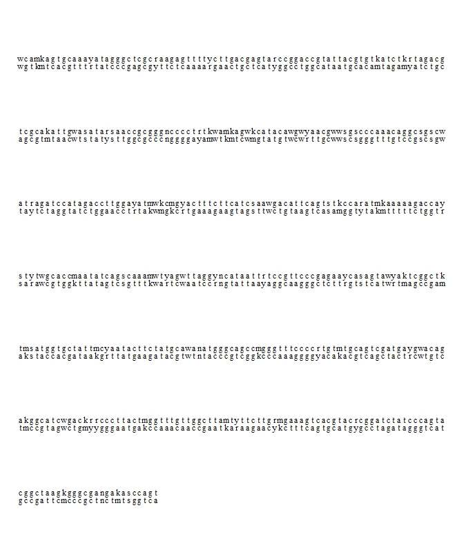
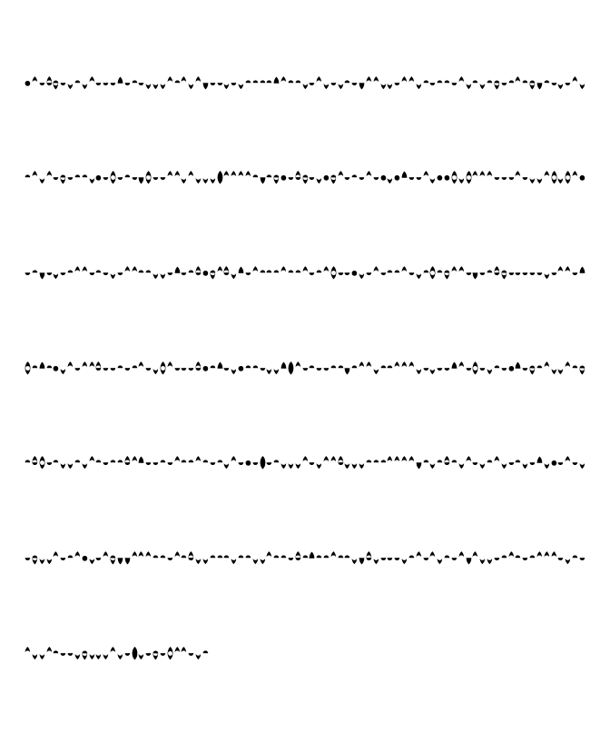
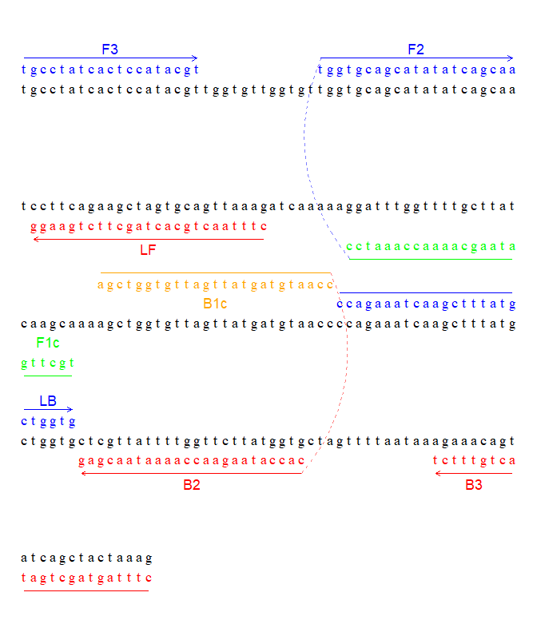
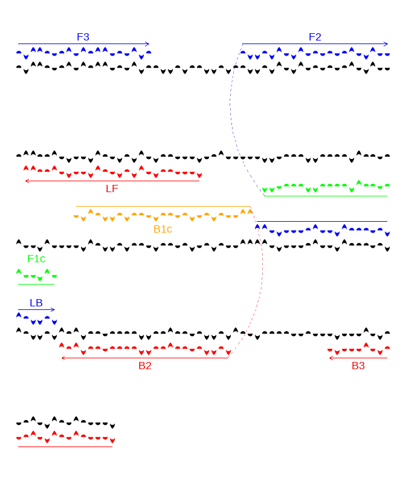

<!-- README.md is generated from README.Rmd. Please edit that file -->

# lampshade

<!-- badges: start -->
<!-- badges: end -->

The goal of lampshade is to manipulate and visualise short DNA sequences
and associated LAMP primers

## Installation

You can install the released version of lampshade from
[CRAN](https://CRAN.R-project.org) with:

``` r
install.packages("lampshade") # doesn't currently exist
```

And the development version from [GitHub](https://github.com/) with:

``` r
# install.packages("devtools")
devtools::install_github("moshejasper/lampshade")
```

## Load and Read DNA Objects

Here we create a simple DNA container object

``` r
library(lampshade)
## basic example code

dframe <- dna_frame(random_sequence_generator(500))
dframe
#> $seqdata
#> # A tibble: 500 x 3
#>    position fwd   cmp  
#>       <dbl> <chr> <chr>
#>  1        1 w     w    
#>  2        2 c     g    
#>  3        3 a     t    
#>  4        4 m     k    
#>  5        5 k     m    
#>  6        6 a     t    
#>  7        7 g     c    
#>  8        8 t     a    
#>  9        9 g     c    
#> 10       10 c     g    
#> # ... with 490 more rows
#> 
#> $fprimers
#> NULL
#> 
#> $rcprimers
#> NULL
#> 
#> $rprimers
#> NULL
#> 
#> $cprimers
#> NULL
```

Now, we are going to visualise this object as double-stranded DNA
(mapped to a5 size)

``` r
simple_dnagraph_double(dframe, family = "serif")
```



Next, we are going to use a custom DNA visualising font - a simple
monochromatic font based on the ambiscript mosaic font described at
<https://bmcgenomics.biomedcentral.com/articles/10.1186/1471-2164-15-52>.
First, we need to change our system settings to enable non-standard
fonts, as we are going to be using a custom DNA font family. This change
will temporarily give graphing control to a 3rd party program using the
`dnagraph_setup()` command. We will restore control later using the
`dnagraph_detach()` command. This process is optional, but needed if we
wish to use the custom `DNAMosaic` font.

``` r
dnagraph_setup()
```

Now, we generate the graph using the custom DNA font, & the layout for a
singlestranded view. The single-stranded view works well with the
DNAMosaic font, as a 180 rotation of the sense yields the antisense
strand.

``` r
simple_dnagraph_single(dframe, family = "DNAMosaic")
```



``` r
dnagraph_detach()
```

## Load and read LAMP objects.

### 1. Manually.

In this section, we are going to load primer sequences based on a
*wAlbB* assay developed for mosquitoes (see
<https://journals.plos.org/plosone/article?id=10.1371/journal.pone.0225321>
for source).

``` r
wspseq <- "TGCCTATCACTCCATACGTTGGTGTTGGTGTTGGTGCAGCATATATCAGCAATCCTTCAGAAGCTAGTGCAGTTAAAGATCAAAAAGGATTTGGTTTTGCTTATCAAGCAAAAGCTGGTGTTAGTTATGATGTAACCCCAGAAATCAAGCTTTATGCTGGTGCTCGTTATTTTGGTTCTTATGGTGCTAGTTTTAATAAAGAAACAGTATCAGCTACTAAAG"

wf3 <- "TGCCTATCACTCCATACGT"
wb3 <- "CTTTAGTAGCTGATACTGTTTCT"
wlb <- "CCAGAAATCAAGCTTTATGCTGGTG"
wlf <- "CTTTAACTGCACTAGCTTCTGAAGG"
wf1c <- "TGCTTGATAAGCAAAACCAAATCC"
wf2 <- "TGGTGCAGCATATATCAGCAA"
wb1c <- "AGCTGGTGTTAGTTATGATGTAACC"
wb2 <- "CACCATAAGAACCAAAATAACGAG"
```

Now, we input them into a lamp primer list object

``` r
wsp_lamp <- lamp_frame(wspseq, wf3, wf2, wf1c, wb1c, wb2, wb3, wlf, wlb)
wsp_lamp
#> $seqdata
#> # A tibble: 222 x 3
#>    position fwd   cmp  
#>       <dbl> <chr> <chr>
#>  1        1 t     a    
#>  2        2 g     c    
#>  3        3 c     g    
#>  4        4 c     g    
#>  5        5 t     a    
#>  6        6 a     t    
#>  7        7 t     a    
#>  8        8 c     g    
#>  9        9 a     t    
#> 10       10 c     g    
#> # ... with 212 more rows
#> 
#> $fprimers
#>  [1]   1   2   3   4   5   6   7   8   9  10  11  12  13  14  15  16  17  18  19
#> [20]  32  33  34  35  36  37  38  39  40  41  42  43  44  45  46  47  48  49  50
#> [39]  51  52 113 114 115 116 117 118 119 120 121 122 123 124 125 126 127 128 129
#> [58] 130 131 132 133 134 135 136 137 138 139 140 141 142 143 144 145 146 147 148
#> [77] 149 150 151 152 153 154 155 156 157 158 159 160 161 162
#> 
#> $rcprimers
#>  [1] 200 201 202 203 204 205 206 207 208 209 210 211 212 213 214 215 216 217 218
#> [20] 219 220 221 222 163 164 165 166 167 168 169 170 171 172 173 174 175 176 177
#> [39] 178 179 180 181 182 183 184 185 186  87  88  89  90  91  92  93  94  95  96
#> [58]  97  98  99 100 101 102 103 104 105 106 107 108 109 110  54  55  56  57  58
#> [77]  59  60  61  62  63  64  65  66  67  68  69  70  71  72  73  74  75  76  77
#> [96]  78
#> 
#> $rprimers
#> NULL
#> 
#> $cprimers
#> NULL
#> 
#> $f3
#> [1] "TGCCTATCACTCCATACGT"
#> 
#> $f2
#> [1] "TGGTGCAGCATATATCAGCAA"
#> 
#> $f1c
#> [1] "TGCTTGATAAGCAAAACCAAATCC"
#> 
#> $b1c
#> [1] "AGCTGGTGTTAGTTATGATGTAACC"
#> 
#> $b2
#> [1] "CACCATAAGAACCAAAATAACGAG"
#> 
#> $b3
#> [1] "CTTTAGTAGCTGATACTGTTTCT"
#> 
#> $lf
#> [1] "CTTTAACTGCACTAGCTTCTGAAGG"
#> 
#> $lb
#> [1] "CCAGAAATCAAGCTTTATGCTGGTG"
#> 
#> $f3pos
#>  [1]  1  2  3  4  5  6  7  8  9 10 11 12 13 14 15 16 17 18 19
#> 
#> $f2pos
#>  [1] 32 33 34 35 36 37 38 39 40 41 42 43 44 45 46 47 48 49 50 51 52
#> 
#> $f1cpos
#>  [1]  87  88  89  90  91  92  93  94  95  96  97  98  99 100 101 102 103 104 105
#> [20] 106 107 108 109 110
#> 
#> $b1cpos
#>  [1] 113 114 115 116 117 118 119 120 121 122 123 124 125 126 127 128 129 130 131
#> [20] 132 133 134 135 136 137
#> 
#> $b2pos
#>  [1] 163 164 165 166 167 168 169 170 171 172 173 174 175 176 177 178 179 180 181
#> [20] 182 183 184 185 186
#> 
#> $b3pos
#>  [1] 200 201 202 203 204 205 206 207 208 209 210 211 212 213 214 215 216 217 218
#> [20] 219 220 221 222
#> 
#> $lfpos
#>  [1] 54 55 56 57 58 59 60 61 62 63 64 65 66 67 68 69 70 71 72 73 74 75 76 77 78
#> 
#> $lbpos
#>  [1] 138 139 140 141 142 143 144 145 146 147 148 149 150 151 152 153 154 155 156
#> [20] 157 158 159 160 161 162
```

Next, we visualise this reaction first as ssDNA in normal fonts

``` r
lamp_dnagraph_single(wsp_lamp, family = "serif")
#> [1] 0.9504808
#> [1] 0.2411058
```


Primers are laid out with arrows describing direction. FIP & BIP
component primers are linked, with F1c and B1c primers associated with
their eventual target sites.

Finally, we visualise this reaction using the DNAMosaic script:

``` r
dnagraph_setup()
lamp_dnagraph_single(wsp_lamp, family = "DNAMosaic")
#> [1] 0.9504808
#> [1] 0.2411058
```



``` r
dnagraph_detach()
```

Note that with ambiscript, orientation is very important. Lines with
arrows show single stranded DNA primer direction. To convert, the
sequence should be read as if the line is ON TOP. (i.e. rotate so primer
line is on top, then read left to right. rotate f1c & b1c sequences in
line wiht the connecting arrow to produce the FIP & BIP primers.)

## Primer Explorer Files

Primer Explorer v5 PrimerInfo files can be loaded with the command
`pe_load_primerinfo()` attaching the filepath. This produces a LampFrame
object that can be graphed as above.

Moshe Jasper October 4, 2021
